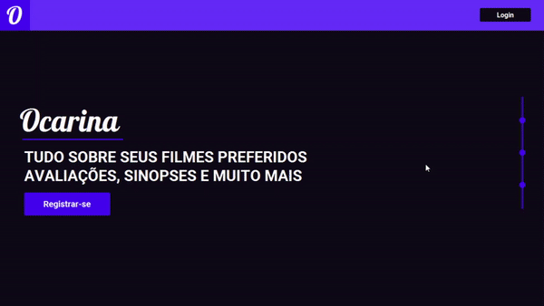

# 🎥 Movie shelf

## ℹ About

System developed as a group project to learn object oriented programming.

It's a system utilized to see a list of movies available so you can get to know more about them, seeing their genre, director, etc.

## 🛠 Technologies used

- Java: programming language
- JavaFX: to build our GUI
- JFoenix: to get beautiful and ready to use elements
- SQLite: to storage all our data

## ✅ Features

- [x] Register, login and update user account
- [x] The administrador of the system can create, read, update and delete movies
- [x] List of movies
  - [x] Filter by Genre
  - [x] Filter by Ratings
  - [x] Search movie by name / movie director
  - [x] Create a list of favorite movies
- [x] Movies can be opened and rated by every user

## ☑ Non-functional Requirements

- [x] E-mail validation
- [x] Password encryption

## ⏩ Result

## 🤔 How to use

🚧 In development...

## 👨‍💻 Our group

<table>
  <tr>
    <td align="center"><a href="https://github.com/arthursca"> <b>Arthur Scanoni</b></a> </td>
    <td align="center"><a href="https://github.com/atilara"> <b>Átila Rodrigues</b></a> </td>
    <td align="center"><a href="https://github.com/noronha1612"> <b>Gabriel Noronha</b></a> </td>
    <td align="center"><a href="https://github.com/luanaccioly"> <b>Luan Accioly</b></a> </td>
    <td align="center"><a href="https://github.com/marioleandro"> <b>Mario Leandro</b></a> </td>
  </tr>
</table>
